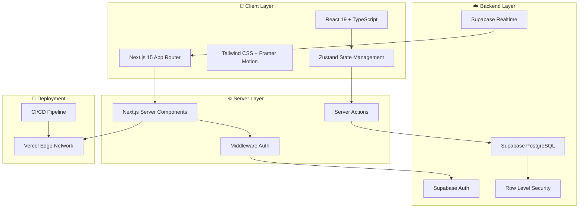
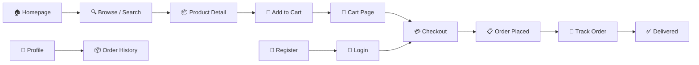
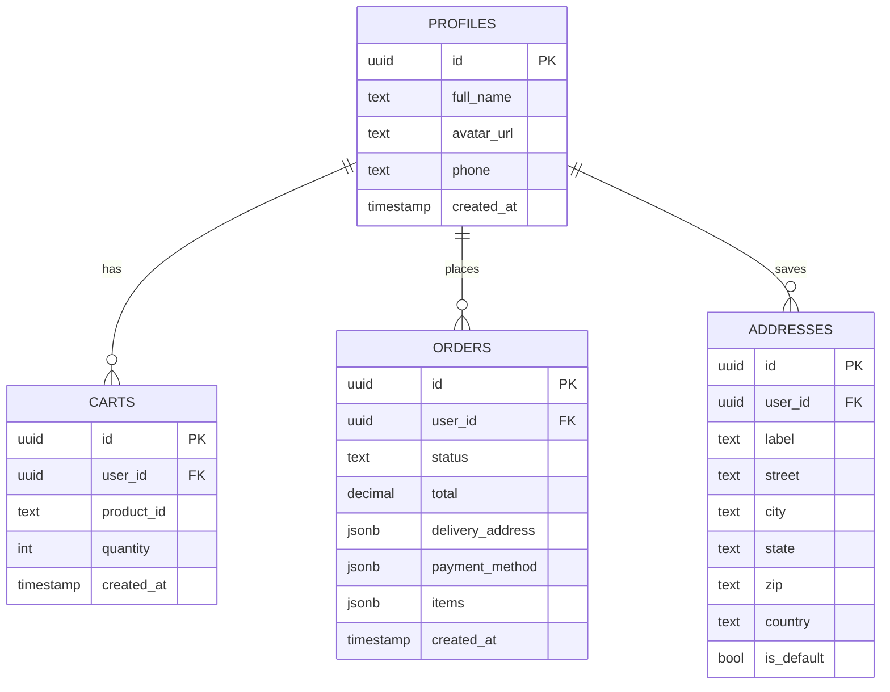
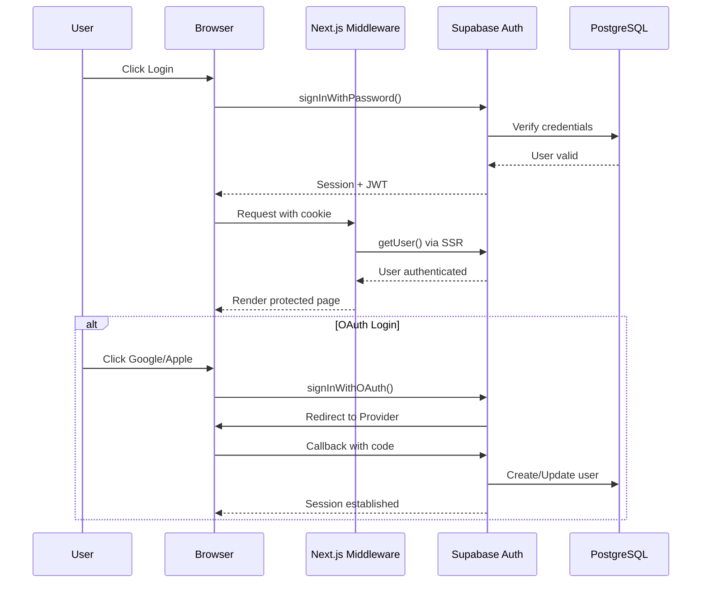
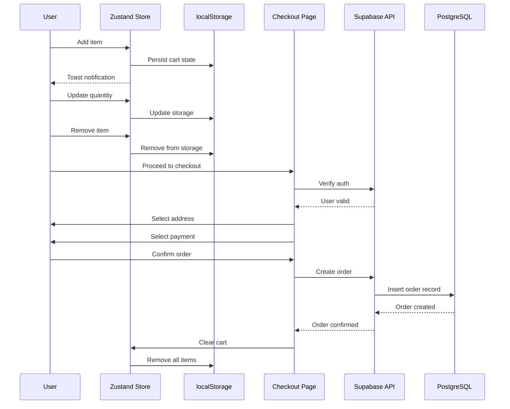
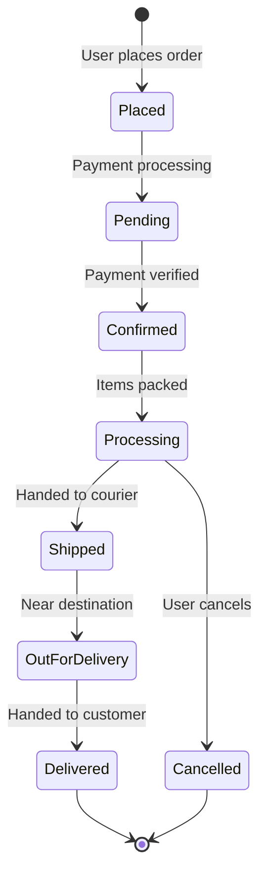

<div align="center">

# 🛒 Gronur

### *Fresh Grocery Delivery — From Farm to Your Doorstep*

[](https://nextjs.org/)
[](https://react.dev/)
[](https://www.typescriptlang.org/)
[](https://supabase.com/)
[](https://tailwindcss.com/)
[](https://vercel.com/)

[🚀 Live Demo](https://gronur.vercel.app) · [📖 Documentation](#documentation) · [🛠️ Setup](#getting-started) · [📋 Roadmap](#roadmap)


</div>

---

## ✨ Features

| Feature | Status | Description |
|---------|--------|-------------|
| 🏠 **Homepage** | ✅ Live | Hero, categories, popular products, features |
| 🔍 **Search & Filter** | ✅ Live | Real-time search, category filter, price range, sorting |
| 🛍️ **Product Catalog** | ✅ Live | 16+ products with ratings, badges, nutrition info |
| 📦 **Shopping Cart** | ✅ Live | Persistent cart with quantity controls |
| 💳 **Checkout Flow** | ✅ Live | 3-step: Address → Payment → Confirm |
| 📱 **Order Tracking** | ✅ Live | Visual timeline with status updates |
| 🔐 **Authentication** | ✅ Live | Email/Password + Google + Apple OAuth |
| 👤 **User Profile** | ✅ Live | Manage info, addresses, order history |
| 📱 **Responsive** | ✅ Live | Mobile-first, works on all devices |
| 🌙 **Dark Mode Ready** | 🔄 Planned | Theme switching |
| 🔔 **Push Notifications** | 🔄 Planned | Order status alerts |
| 🗺️ **Live Tracking** | 🔄 Planned | Real-time delivery map |

---

## 🏗️ Architecture



---

## 🔄 User Flow Diagram



---

## 🗄️ Database Schema



---

## 🔐 Authentication Flow



---

## 🛒 Cart & Checkout Flow



---

## 📊 Order Tracking State Machine



---

## 🛠️ Tech Stack

| Layer | Technology | Version | Purpose |
|-------|-----------|---------|---------|
| **Framework** | Next.js | 15.0 | React framework with App Router |
| **UI Library** | React | 19.0 | Component-based UI |
| **Language** | TypeScript | 5.6 | Type safety |
| **Styling** | Tailwind CSS | 3.4 | Utility-first CSS |
| **Animations** | Framer Motion | 11.0 | Page & component animations |
| **State** | Zustand | 5.0 | Global state management |
| **Backend** | Supabase | 2.49 | Database, Auth, Realtime |
| **Icons** | Lucide React | 0.46 | Consistent icon system |
| **Forms** | React Hook Form | 7.54 | Form handling |
| **Validation** | Zod | 3.23 | Schema validation |
| **Deployment** | Vercel | — | Edge deployment |

---

## 📁 Project Structure

```
gronur-grocery/
├── 📂 src/
│   ├── 📂 app/                          # Next.js 15 App Router
│   │   ├── 📄 page.tsx                  # 🏠 Home (Hero + Categories + Products)
│   │   ├── 📄 layout.tsx              # 🖼️ Root layout with Navbar + Footer
│   │   ├── 📄 globals.css             # 🎨 Global styles + Tailwind
│   │   ├── 📂 auth/callback/          # 🔐 OAuth callback handler
│   │   ├── 📂 cart/                   # 🛒 Shopping cart page
│   │   ├── 📂 categories/[id]/        # 📂 Category filtered products
│   │   ├── 📂 checkout/               # 💳 Multi-step checkout
│   │   ├── 📂 login/                  # 🔐 Sign in page
│   │   ├── 📂 orders/                 # 📦 Order history
│   │   ├── 📂 orders/[id]/            # 📋 Order detail + tracking
│   │   ├── 📂 product/[id]/           # 🍎 Product detail page
│   │   ├── 📂 products/               # 📦 All products with filters
│   │   ├── 📂 profile/                # 👤 User profile
│   │   ├── 📂 register/               # 📝 Sign up page
│   │   └── 📂 search/                 # 🔍 Search results
│   │
│   ├── 📂 components/
│   │   ├── 📂 home/
│   │   │   ├── 📄 Hero.tsx            # 🎬 Animated hero section
│   │   │   ├── 📄 CategoriesSection.tsx # 📂 Category cards
│   │   │   ├── 📄 PopularProducts.tsx # 🔥 Best sellers grid
│   │   │   └── 📄 Features.tsx        # ✨ Why choose us
│   │   ├── 📂 product/
│   │   │   └── 📄 ProductCard.tsx     # 🃏 Product card component
│   │   └── 📂 ui/
│   │       ├── 📄 Navbar.tsx          # 🧭 Responsive navigation
│   │       ├── 📄 Footer.tsx          # 📋 Site footer
│   │       └── 📄 Toaster.tsx         # 🍞 Toast notifications
│   │
│   ├── 📂 hooks/
│   │   └── 📄 useCart.ts              # 🛒 Zustand cart store
│   │
│   ├── 📂 lib/
│   │   ├── 📄 utils.ts                # 🧰 Utility functions
│   │   └── 📂 supabase/
│   │       ├── 📄 client.ts           # 🌐 Browser client
│   │       ├── 📄 server.ts           # 🖥️ Server client
│   │       └── 📄 middleware.ts       # 🛡️ Session middleware
│   │
│   ├── 📂 types/
│   │   └── 📄 index.ts                # 📐 TypeScript interfaces
│   │
│   └── 📂 data/
│       └── 📄 products.ts             # 🥑 Product & category data
│
├── 📂 supabase/
│   └── 📂 migrations/
│       └── 📄 001_initial_schema.sql  # 🗄️ Database setup + RLS
│
├── 📄 middleware.ts                   # 🔒 Route protection
├── 📄 tailwind.config.ts              # 🎨 Custom design system
├── 📄 next.config.js                  # ⚙️ Next.js config
├── 📄 package.json                    # 📦 Dependencies
└── 📄 .env.example                    # 🔑 Environment template
```

---

## 🚀 Getting Started

### Prerequisites

- **Node.js** 18+ ([download](https://nodejs.org/))
- **npm** or **yarn**
- **Supabase** account ([sign up free](https://supabase.com))

### 1. Clone & Install

```bash
git clone https://github.com/Arslan-web-Dev/full-stack-grocery-delivery-web-app-.git
cd full-stack-grocery-delivery-web-app-
npm install
```

### 2. Environment Setup

```bash
cp .env.example .env.local
```

Fill in your Supabase credentials:

```env
NEXT_PUBLIC_SUPABASE_URL=https://your-project.supabase.co
NEXT_PUBLIC_SUPABASE_ANON_KEY=your-anon-key
```

### 3. Database Setup

1. Go to [Supabase Dashboard](https://app.supabase.com)
2. Open **SQL Editor**
3. Run the migration:

```sql
-- Run: supabase/migrations/001_initial_schema.sql
```

4. Configure **Authentication** → **Providers**:
   - Enable **Google** OAuth
   - Enable **Apple** OAuth
   - Add redirect URL: `http://localhost:3000/auth/callback`

### 4. Run Development Server

```bash
npm run dev
```

Open [http://localhost:3000](http://localhost:3000) 🎉

---

## 📦 Build & Deploy

```bash
# Build for production
npm run build

# Start production server
npm start
```

### Deploy to Vercel

[](https://vercel.com/new/clone?repository-url=https://github.com/Arslan-web-Dev/full-stack-grocery-delivery-web-app-)

1. Push to GitHub
2. Import on [Vercel](https://vercel.com)
3. Add environment variables
4. Deploy! 🚀

---

## 🧪 Testing

```bash
# Run linting
npm run lint

# Type checking
npx tsc --noEmit
```

---

## 🗺️ Roadmap

- [x] Core product catalog
- [x] Shopping cart with persistence
- [x] User authentication (Email + OAuth)
- [x] Order management & tracking
- [x] Responsive design
- [x] Search & filtering
- [ ] 🔄 Stripe payment integration
- [ ] 🔄 Real-time delivery tracking map
- [ ] 🔄 Push notifications
- [ ] 🔄 Admin dashboard
- [ ] 🔄 Dark mode toggle
- [ ] 🔄 Multi-language support
- [ ] 🔄 Wishlist / Favorites
- [ ] 🔄 Product reviews & ratings
- [ ] 🔄 Coupon / Promo codes

---

## 🤝 Contributing

Contributions are welcome! Please follow these steps:

1. Fork the repository
2. Create a feature branch: `git checkout -b feature/amazing-feature`
3. Commit changes: `git commit -m 'Add amazing feature'`
4. Push to branch: `git push origin feature/amazing-feature`
5. Open a Pull Request

---

## 📄 License

Distributed under the **MIT License**. See `LICENSE` for more information.

---

## 📞 Support

- 📧 Email: support@gronur.com
- 🐛 Issues: [GitHub Issues](https://github.com/Arslan-web-Dev/full-stack-grocery-delivery-web-app-/issues)
- 💬 Discussions: [GitHub Discussions](https://github.com/Arslan-web-Dev/full-stack-grocery-delivery-web-app-/discussions)

---

<div align="center">

**Built with ❤️ using Next.js 15, React 19, and Supabase**

[⬆ Back to Top](#-gronur)

</div>
